# **Jarkom-Modul-4-ITB09-2022**
Laporan Resmi Praktikum Jaringan Komunikasi Modul 4

---

## **Anggota Kelompok**
| Nama                   | NRP        |
| ---------------------- | ---------- |
| Rama Muhammad Murshal  | 5027201041 |
| Satrio Kamil Widhiwoso | 5027201051 |
| Fairuz Azhar Auzan     | 5027201059 |

---

### Topologi Yang Harus dibentuk

### **VLSM**
Dalam menyelesaikan soal VLSM, kita menggunakan **Cisco Packet Tracer**. Pertama-tama, kita urutkan terlebih dahulu node yang membutuhkan paling banyak host, menjadi seperti berikut:

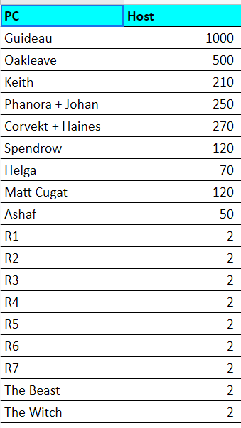

Setelah itu, kita gunakan tabel subnetting berikut untuk menentukan PC Guideau akan memiliki subnet mask berapa:

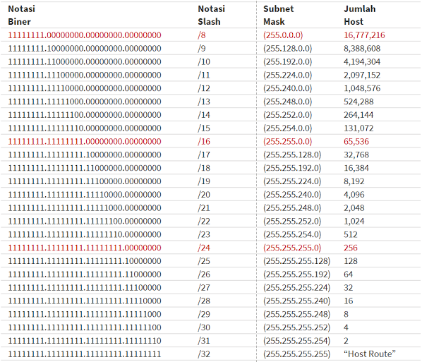

Karena PC Guideau membutuhkan 1000 host, sehingga kita memiliki subnet mask **/22**. Begitu pun seterusnya sehingga kita mendapatkan data sebagai berikut:

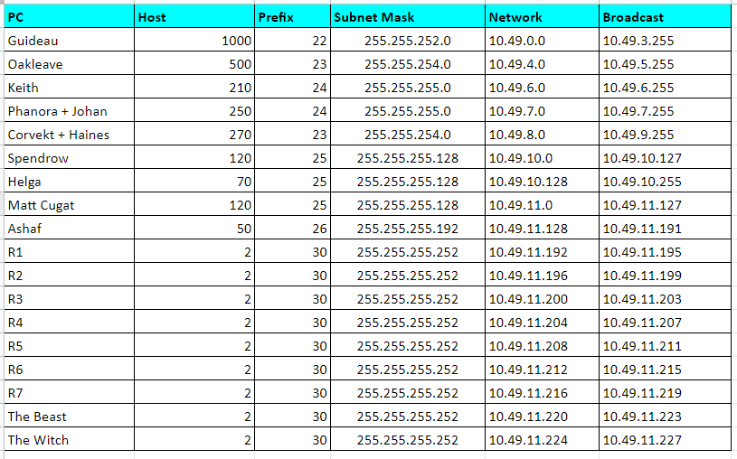

Berdasarkan data tersebut, kita inputkan masing-masing network yang dimiliki ke **Cisco Packet Tracer**.

Topologi yang kita bangun:

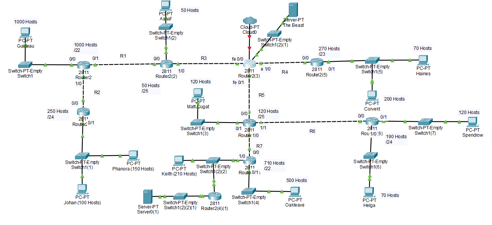

Satu contoh untuk konfigurasi network pada **The Resonnance** yang mengarah ke **Ashaf**.

- Menambahkan port **NM-2FE2W** pada router:

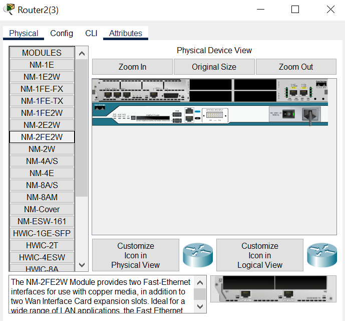

- Pada router **The Resonnance**, atur interface yang mengarah ke router **The Order**:

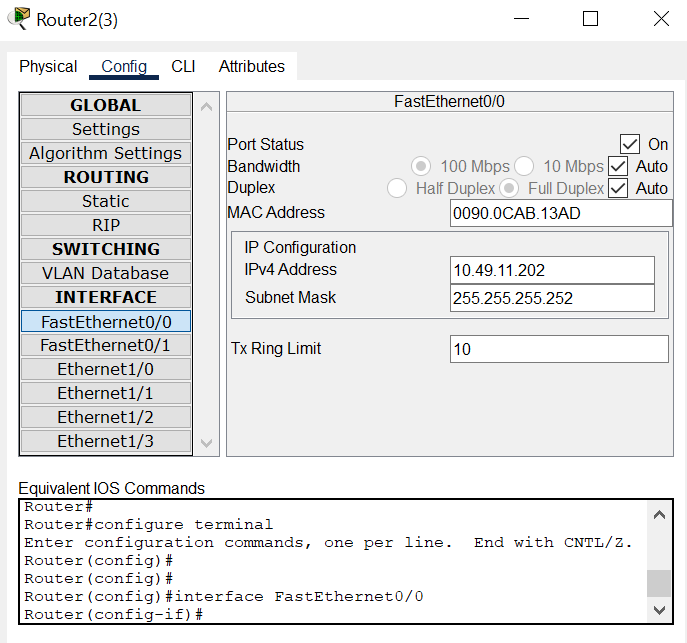

- Pada router **The Order**, atur interface yang mengarah ke router **The Resonnance**:

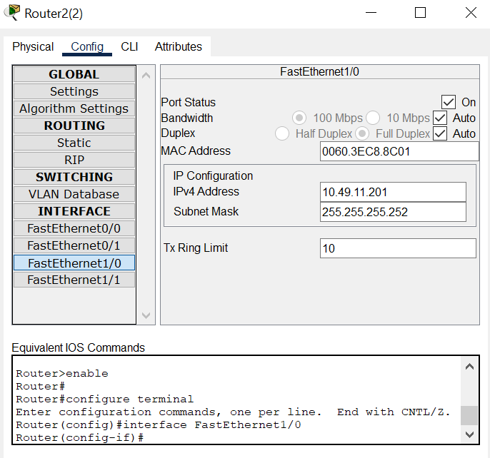

- Kemudian pada router **The Order**, atur IP yang akan mengarah ke client **Ashaf** serta tidak lupa untuk menyalakan port statusnya:

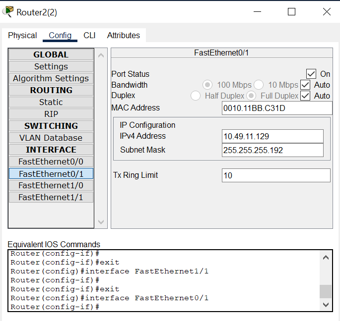

- Kemudian pada sisi client **Ashaf**, kita atur IP configurationnya untuk mengarah ke router **The Order** sebagai berikut:

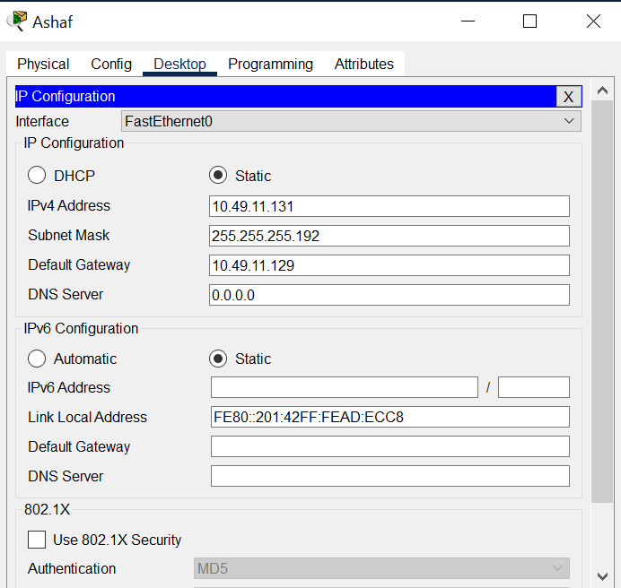

- Kemudian, kita lakukan routing pada **The Resonnance sebagai berikut:

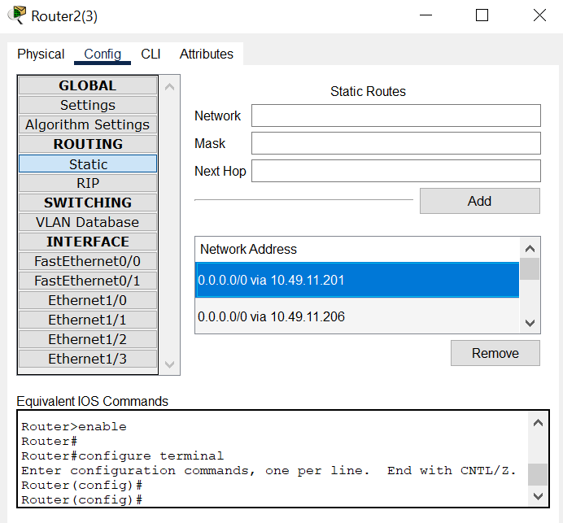

- Kemudian, karena router **The Order** berada langsung di bawah router **The Resonnance** yang konek ke cloud, kita perlu tambahkan default routing agar data yang melintas dapat dikirim dengan sesuai:

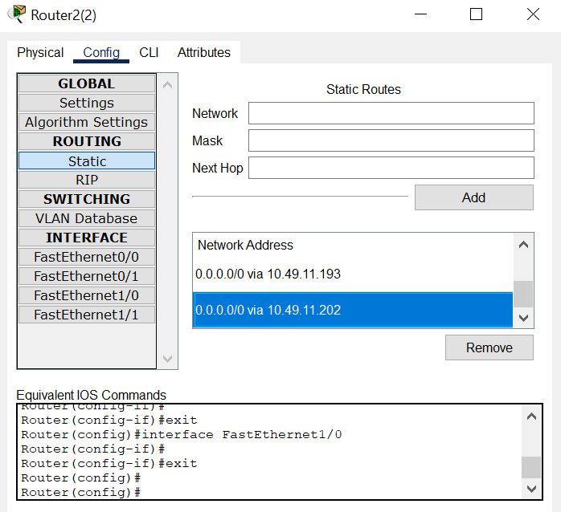

### **CIDR**
Kami tidak sempat untuk menyelesaikan metode CIDR.

### **Kendala**
Kami masih belum paham bagaimana metode CIDR ini bekerja.